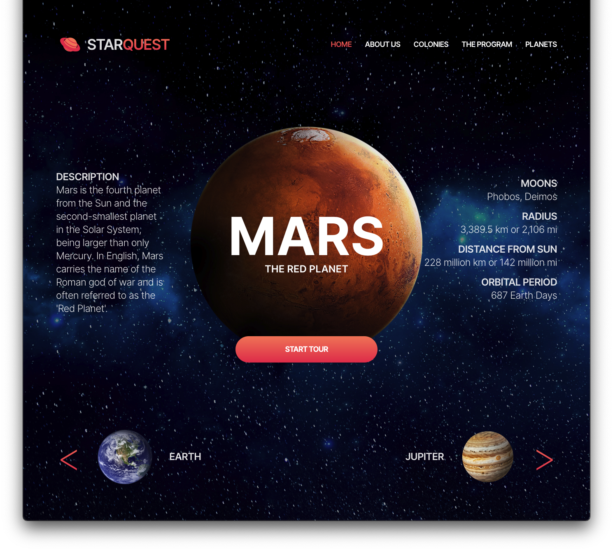

# Starquest

Starquest is a web application developed using Vite, React, and Tailwind CSS. It serves as practice for translating designs into functional code. The final product will not be completely perfect due to a lack of original assets but will be as close as possible to the original. This project was created to hone UI development skills by implementing design concepts into a responsive and interactive web interface.

## Features

- Responsive UI design implementation
- Utilizes Vite for a fast development environment
- Built with React for component-based architecture
- Styled using Tailwind CSS for modern and customizable styling

## Screenshots
### Original Design


### My Rendition


## Installation

1. Clone the repository: `git clone https://github.com/your-username/Starquest.git`
2. Navigate to the project directory: `cd Starquest`
3. Install dependencies: `pnpm install` or `npm install`

## Usage

To start the development server:

```bash
pnpm run dev
```
or 

```bash
npm run dev
```
